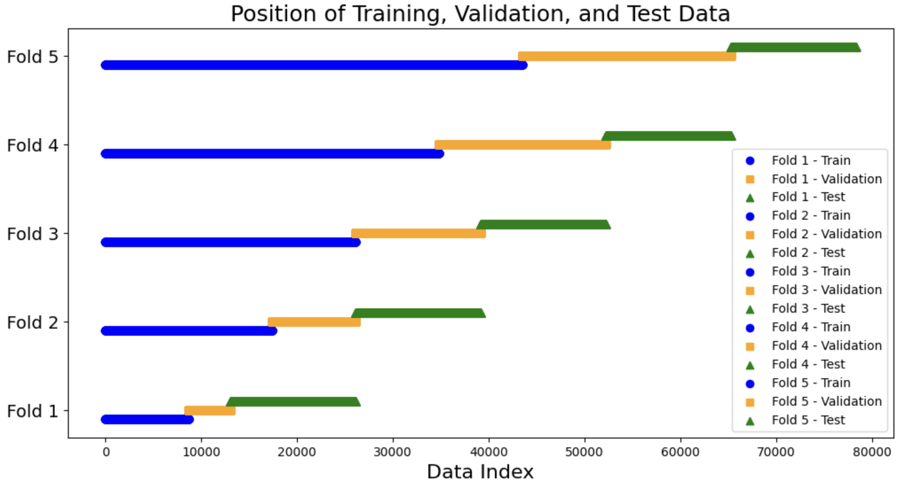
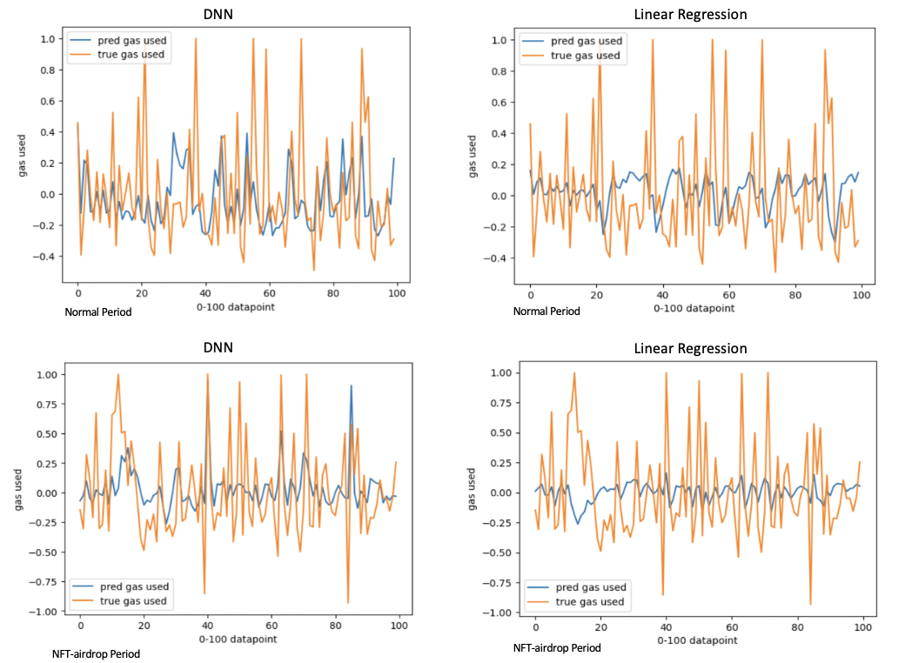
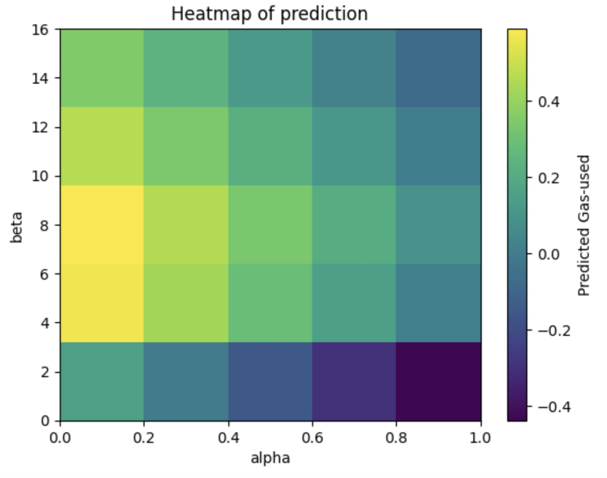

# Enhancing the Efficiency of Blockchain Transaction Fees: Predicting Gas Usage Proactively with Machine Learning in the EIP-1559 Era

## Supplementary resource,data and code

## Table of Contents

- Data
- Methodology
- Code
- Result
- Reference

## Data
#### Collected Data
We collect the data through BigQuery, and the code we used is attached here.

[Code for querying data](./data/DataQuery.txt)

You can also refer to [BigQuery](https://console.cloud.google.com/bigquery?p=bigquery-public-data&d=crypto_ethereum_classic&page=dataset&project=psyched-service-412017&ws=!1m9!1m4!4m3!1sbigquery-public-data!2sethereum_blockchain!3slive_blocks!1m3!3m2!1sbigquery-public-data!2scrypto_ethereum_classic&pli=1) for more information. 

#### Data Infomation
| Data Files  | Data Type | Data Content |
| ------------- | ------------- | ------------- |
| [ETH-NFT-airdrop.csv](https://github.com/JingfengSteven/Chain_Science_24/blob/64c1cc6b642d8df8285cec8fd78b34f60ba66ecb/data/ETH-NFT-airdrop.csv)  | Raw Data  | Critical indicators related to gas during NFT airdrop period |
| [ETH-Normal.csv](https://github.com/JingfengSteven/Chain_Science_24/blob/64c1cc6b642d8df8285cec8fd78b34f60ba66ecb/data/ETH-Normal.csv)  | Raw Data  | Critical indicators related to gas during normal period  |

#### Data Dictionary
- **ETH-NFT-airdrop.csv and ETH-Normal.csv**

| Variable Name          | Description                       | Type    |
|------------------------|-----------------------------------|---------|
| timestamp              | Recoding of the time of each block|  String |
| number                 | The number of blocks on the chain | Numeric |
| gas_used               | Actual gas used                   | Numeric |
| gas_limit              | The maximum allowed gas per block | Numeric |
| base_fee_per_gas       | The base fee set for each block   | Numeric |

## Methodology
In the original dataset, the base fee is denominated in units of Gwei, where each Gwei is equivalent to $10^{-9}$ Ether. Consequently, for enhanced interpretability of the dataset, we scale the base fee by $10^{-9}$, expressing it in terms of Ether.

Gas limit and gas target are two significant indicators in TFM. Specifically, the gas limit refers to the maximum amount of gas that can be consumed when executing smart contracts or transactions on each block. Gas target refers to the gas amount people want to achieve in one block. To ensure the efficiency of transactions, the gas target should equal half of the gas limit. 

Our approach uses the four machine learning models mentioned before to predict y, which represents the normalized gas use:

$$Y = \frac{gasUsed-gasTarget}{gasTarget}$$

This formula will shift the y within a range of [-1,1]. Or, in simple terms, this formula compares the actual gas used to the target gas limit, allowing us to assess how far off the gas usage is from the intended target. The $X$ is the variable used as features, containing $\alpha$ and $\beta$. 
The corresponding $\alpha$ and $\beta$ are calculated by the following formulas:

$$\alpha = \frac{x_{1}}{x_{2}}$$

$$\beta = base fee$$

where $x_1$ denotes the feature gas-used and $x_2$ denotes the feature gas-limit.For varying periods $k$, the regressor variable for the preceding $k$ data points is collected into a list, forming the feature set $X$. The variable $Y$ corresponds precisely to the prediction variable for the data point at time $t$.

- **Additional Variables we create**

| Variable Name          | Description                       | Type    |
|------------------------|-----------------------------------|---------|
| gas_fraction           | Fraction between Gas Used and Gas Limit     | Numeric |
| gas_target             | The optimal gas used for each block         | Numeric |
| Y                      | Normalized Gas Used | Numeric               |
| Yt                | Response variable equals to the gas_fraction| Numeric |

## Code

| Code Files  | Code Description |
| ------------- | -------------  | 
| [blockChainGasPrediction.ipynb](https://github.com/JingfengSteven/Chain_Science_24/blob/64c1cc6b642d8df8285cec8fd78b34f60ba66ecb/code/blockChainGasPrediction.ipynb)  | Using linear algorithm, DNN, XGBoost and long-short term memory to predict gas used. |

## Result

### Train-test split

<table>
    <tr>
        <td> Train-test split at NFT-airdrop period</td>
        <td></td>
        <td><a href="./results/nft-position.png">Train-test split at NFT-airdrop period</a></td>
    </tr>
    <tr>
        <td> Train-test split at normal period</td>
        <td></td>
        <td><a href="./results/none nft-position.png">Train-test split at normal period</a></td>
    </tr>
   
</table>

###  NFT airdrop period
<table>
    <tr>
        <td> Cross Validation Results at NFT-airdrop period</td>
        <td></td>
        <td><a href="./results/Cross-validation results for different algorithms in NFT airdrop period.png">Cross Validation Results in NFT-airdrop period</a></td>
    </tr>
    <tr>
        <td> Accuracy Comparison at NFT-airdrop period </td>
        <td></td>
        <td><a href="./results/s1.png"> Accuracy Comparison</a></td>
    </tr>
    <tr>
        <td> Variance Comparison at NFT-airdrop period </td>
        <td></td>
        <td><a href="./results/s3.png">Variance Comparison</a></td>
    </tr>
</table>

###  Normal period
<table>
    <tr>
        <td> Cross Validation Results at Normal period</td>
        <td></td>
        <td><a href="./results/Cross-validation results for different algorithms in normal period.png">Cross Validation Results in normal period</a></td>
    </tr>
    <tr>
        <td> Accuracy Comparison at Normal period </td>
        <td></td>
        <td><a href="./results/s2.png">Accuracy Comparison</a></td>
    </tr>
    <tr>
        <td> Variance Comparison at Normal period </td>
        <td></td>
        <td><a href="./results/s4.png">Variance Comparison</a></td>
    </tr>
</table>

###  The training of DNN
<table>
    <tr>
        <td> Training of DNN</td>
        <td></td>
        <td><a href="./results/training eporch.png">Training curve of DNN</a></td>
    </tr>
</table>
    
###  Comparision between DNN and linear regression
<table>
    <tr>
        <td> Comparision of DNN and Linear Regression</td>
        <td></td>
        <td><a href="./results/comparison.1.png">Comparision over Linear Regression and DNN over two periods</a></td>
    </tr>
</table>

###  Heatmap of prediction
<table>
    <tr>
        <td> Heatmap of prediction</td>
        <td></td>
        <td><a href="./results/final.1.png">Heatmap of prediction</a></td>
    </tr>
</table>

## Reference
[Data reference](https://console.cloud.google.com/bigquery?p=bigquery-public-data&d=crypto_ethereum_classic&page=dataset&project=psyched-service-412017&ws=!1m9!1m4!4m3!1sbigquery-public-data!2sethereum_blockchain!3slive_blocks!1m3!3m2!1sbigquery-public-data!2scrypto_ethereum_classic&pli=1) 
