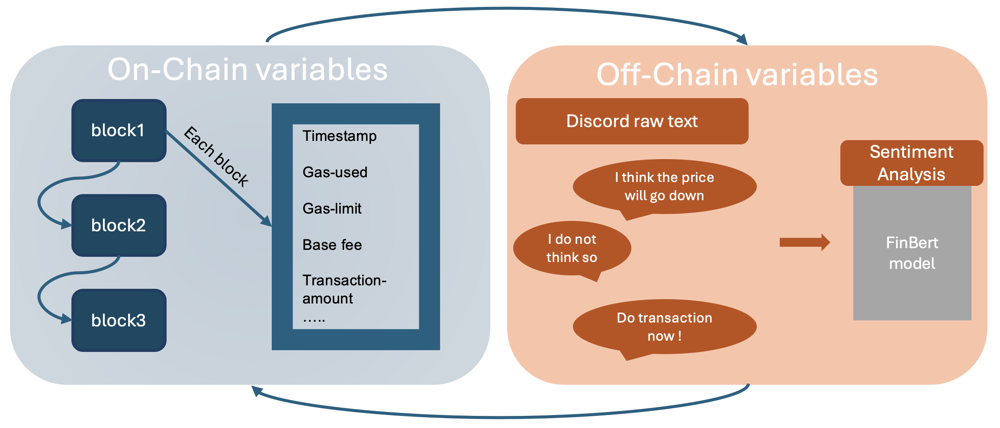

# FinML-Chain: A Blockchain-Integrated Dataset for Enhanced Financial Machine Learning

## Table of Contents

- Data
- Code
- Result
- Reference

## Data
#### Collection for On-chain Data
We collect the data through BigQuery, and the code we used is in [Query](https://huggingface.co/datasets/dkublockchain/FinML_Chain/blob/main/data/DataQuery.txt)

[Code for querying data](./data/DataQuery.txt)

You can also refer to [BigQuery](https://console.cloud.google.com/bigquery?p=bigquery-public-data&d=crypto_ethereum_classic&page=dataset&project=psyched-service-412017&ws=!1m9!1m4!4m3!1sbigquery-public-data!2sethereum_blockchain!3slive_blocks!1m3!3m2!1sbigquery-public-data!2scrypto_ethereum_classic&pli=1) for more information. 

#### Collection for Off-chain Data

### On-chain Data Infomation
| Data Files  | Data Type | Data Content |
| ------------- | ------------- | ------------- |
| [ETH-Token-airdrop.csv](https://huggingface.co/datasets/dkublockchain/FinML_Chain/blob/main/data/eth-onchain-03%3A2023_04%3A2023.csv)  | Raw Data  | Critical indicators related to gas during tokrn airdrop period |
| [ETH-Normal.csv](https://huggingface.co/datasets/dkublockchain/FinML_Chain/blob/main/data/eth-onchain-06%3A2023-07%3A2023.csv)  | Raw Data  | Critical indicators related to gas during normal period  |

#### On chain Data Dictionary
- **ETH-Token-airdrop.csv and ETH-Normal.csv**

| Variable Name          | Description                       | Type    |
|------------------------|-----------------------------------|---------|
| timestamp              | Recoding of the time of each block|  String |
| number                 | The number of blocks on the chain | Numeric |
| gas_used               | Actual gas used                   | Numeric |
| gas_limit              | The maximum allowed gas per block | Numeric |
| base_fee_per_gas       | The base fee set for each block   | Numeric |

- **Additional Variables we create**

| Variable Name          | Description                       | Type    |
|------------------------|-----------------------------------|---------|
| gas_fraction           | Fraction between Gas Used and Gas Limit     | Numeric |
| gas_target             | The optimal gas used for each block         | Numeric |
| Y                      | Normalized Gas Used | Numeric               |
| Yt                | Response variable equals to the gas_fraction| Numeric |

### Off-chain Data Information

| Variable Name          | Description                       | Type    |
|------------------------|-----------------------------------|---------|
| chat text              | people's chat (sentences)           | String  |

## Code

| Code Files  | Code Description |
| ------------- | -------------  | 
| [main_dataset_processing_code.ipynb](https://huggingface.co/datasets/dkublockchain/FinML_Chain/blob/main/code/main_dataset_processing_code.ipynb)  | Applying FinBert to process discord information; Applying the NAM model to manipulate monotonicity; Applying Both on-chain data and off-chain data to train the model
| [NAM models.py](https://huggingface.co/datasets/dkublockchain/FinML_Chain/blob/main/code/NAM_models.py) | NAM model
| [baseline_dataset_processing_code.ipynb](https://huggingface.co/datasets/dkublockchain/FinML_Chain/blob/main/code/baseline_dataset_processing_code.ipynb) | Using linear algorithm, DNN, XGBoost and long-short term memory to predict gas used.

## Results

### Baseline results
<table>
    <tr>
        <td> Baseline loss for Token-airdrop period</td>
        <td></td>
        <td><a href="./results/s1.png">Baseline loss for Token-airdrop period</a></td>
    </tr>
    <tr>
        <td> Baseline variance for Token-airdrop period</td>
        <td></td>
        <td><a href="./results/s3.png">Baseline variance for Token-airdrop period</a></td>
    </tr>
</table>

<table>
    <tr>
        <td> Baseline loss for normal period</td>
        <td></td>
        <td><a href="./results/s2.png">Baseline loss for normal period</a></td>
    </tr>
    <tr>
        <td> Baseline variance for normal period</td>
        <td></td>
        <td><a href="./results/s4.png">Baseline variance for normal period</a></td>
    </tr>
</table>

### Flow chart
<table>
    <tr>
        <td> Flow chart of combination of Off-chain and On-chain</td>
        <td></td>
        <td><a href="./method/flowchart.png">Flow chart of combination of Off-chain and On-chain</a></td>
    </tr>
</table>

###  Monotonicity Two-step training loss (normal training and monotonic training)
We utilized the NAM model due to its inherent transparency characteristic and the ability to isolate variables, facilitating the imposition of monotonicity constraints on specific features. The model is trained on data from two distinct periods, achieving weak pairwise monotonicity over the $\alpha$ feature. In the first step, standard training is conducted to enable the model to learn from the data. In the second step, we impose monotonic constraints. 

<table>
    <tr>
        <td> Two-step training loss </td>
        <td><a href="./results/training_loss_2_step.pdf">Two-step training loss</a></td>
    </tr>
</table>

### Sentiment (Combination of Off-chain and On-chain)
We further explore the NAM model at k=1,2 and 3. Given the availability of both on-chain and off-chain variables, we conducted tests to determine whether the inclusion of off-chain variables, specifically sentiment analysis, enhances the model's predictability.
<h2>Model Performance over Two Periods</h2>
<table>
    <caption>Model Performance over Two Periods</caption>
    <thead>
        <tr>
            <th class="gray-bg"></th>
            <th class="gray-bg">+OC,+DS,+HS</th>
            <th class="gray-bg">+OC,+DS,-HS</th>
            <th class="gray-bg">+OC,-DS,+HS</th>
            <th class="gray-bg">+OC,-DS,-HS</th>
        </tr>
    </thead>
    <tbody>
        <tr>
            <td colspan="5" class="gray-bg"><strong>Period 1: 03/21/2023 - 04/01/2023 (ARB-airdrop)</strong></td>
        </tr>
        <tr>
            <td class="gray-bg">3 Timesteps</td>
            <td>0.10022</td>
            <td>0.10150</td>
            <td>0.10164</td>
            <td>0.10201</td>
        </tr>
        <tr>
            <td class="gray-bg">2 Timesteps</td>
            <td>0.10056</td>
            <td>0.10249</td>
            <td>0.10213</td>
            <td>0.10265</td>
        </tr>
        <tr>
            <td class="gray-bg">1 Timestep</td>
            <td>0.10169</td>
            <td>0.10190</td>
            <td>0.10204</td>
            <td>0.10290</td>
        </tr>
        <tr>
            <td colspan="5" class="gray-bg"><strong>Period 2: 06/01/2023 - 07/01/2023 (Normal)</strong></td>
        </tr>
        <tr>
            <td class="gray-bg">3 Timesteps</td>
            <td>0.13341</td>
            <td>0.15657</td>
            <td>0.16142</td>
            <td>0.16089</td>
        </tr>
        <tr>
            <td class="gray-bg">2 Timesteps</td>
            <td>0.13477</td>
            <td>0.15381</td>
            <td>0.15806</td>
            <td>0.16456</td>
        </tr>
        <tr>
            <td class="gray-bg">1 Timestep</td>
            <td>0.13593</td>
            <td>0.15321</td>
            <td>0.15459</td>
            <td>0.18428</td>
        </tr>
    </tbody>
</table>

The notation "OC" refers to On-chain variables, while "HS" and "DS" denote Hourly Averaged Sentiment and Daily Averaged Sentiment, respectively. The ‘+’ symbol indicates the inclusion of a variable in the model, whereas the ‘-’ symbol denotes its exclusion. The numerical values represent the mean square error (MSE) of the model on the test dataset.

