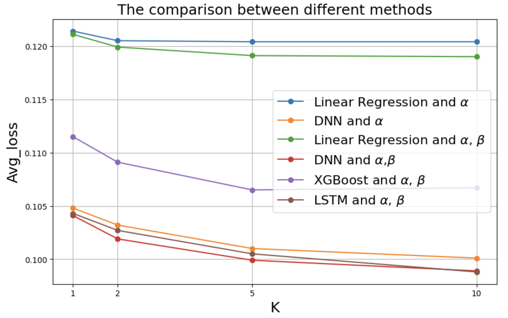
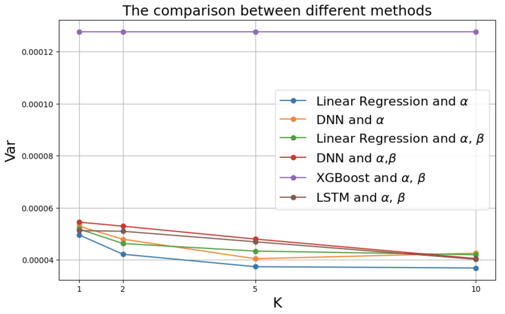
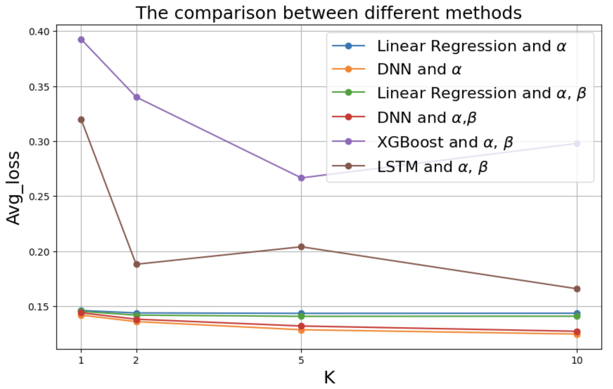
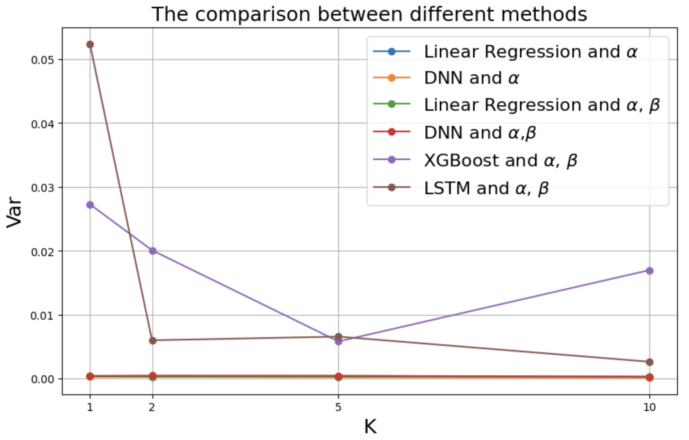

# Gas Used Prediction Using Machine Learning: Foundation for Shifting the Transaction Fee Mechanism from Post-adjustment to Pre-adjustment

## Supplementary resource,data and code

## Table of Contents

- Data
- Code
- Result
- Reference
#### Collected Data
#### Data Infomation
| Data Files  | Data Type | Data Content |
| ------------- | ------------- | ------------- |
| [ETH-NFT-airdrop.csv](https://github.com/JingfengSteven/Chain_Science_24/blob/64c1cc6b642d8df8285cec8fd78b34f60ba66ecb/data/ETH-NFT-airdrop.csv)  | Raw Data  | Critical indicators related to gas during NFT airdrop period |
| [ETH-Normal.csv](https://github.com/JingfengSteven/Chain_Science_24/blob/64c1cc6b642d8df8285cec8fd78b34f60ba66ecb/data/ETH-Normal.csv)  | Raw Data  | Critical indicators related to gas during normal period  |

#### Data Dictionary
- **ETH-NFT-airdrop.csv and ETH-Normal.csv**

| Variable Name          | Description                       | Type    |
|------------------------|-----------------------------------|---------|
| timestamp              | Recoding of the time of each block|  String |
| number                 | The number of blocks on the chain | Numeric |
| gas_used               | Actual gas used                   | Numeric |
| gas_limit              | The maximum allowed gas per block | Numeric |
| base_fee_per_gas       | The base fee set for each block   | Numeric |

## Methodology
In the original dataset, the base fee is denominated in units of Gwei, where each Gwei is equivalent to $10^{-9}$ Ether. Consequently, for enhanced interpretability of the dataset, we scale the base fee by $10^{-9}$, expressing it in terms of Ether.

We create a regressor, denoted as $\alpha$, by computing the ratio of gas used to the gas limit. The predicted variable $Y$ represents the normalized gas used, determined by the formula:

$$w = \frac{gasUsed-gasTarget}{gasTarget}$$,

For varying periods $k$, the regressor variable for the preceding $k$ data points is collected into a list, forming the feature set $X$. The variable $Y$ corresponds precisely to the prediction variable for the data point at time $t$.

- **Additional Variables we create**

| Variable Name          | Description                       | Type    |
|------------------------|-----------------------------------|---------|
| gas_fraction           | Fraction between Gas Used and Gas Limit     | Numeric |
| gas_target             | The optimal gas used for each block         | Numeric |
| Y                      | Normalized Gas Used | Numeric               |
| Yt                | Response variable equals to the gas_fraction| Numeric |

## Code

| Code Files  | Code Description |
| ------------- | -------------  | 
| [blockChainGasPrediction.ipynb](https://github.com/JingfengSteven/Chain_Science_24/blob/64c1cc6b642d8df8285cec8fd78b34f60ba66ecb/code/blockChainGasPrediction.ipynb)  | Using linear algorithm, DNN, XGBoost and long-short term memory to predict gas used. |

## Result

### Train-test split

<table>
    <tr>
        <td> Train-test split in NFT-airdrop period </td>
        <td></td>
        
    </tr>
    <tr>
        <td> Train-test split in normal period </td>
        <td></td>

    </tr>
    
</table>

###  NFT airdrop period
<table>
    <tr>
        <td> Cross Validation Results at NFT-airdrop period</td>
        <td></td>
        <td><a href="./results/Cross-validation results for different algorithms in NFT airdrop period.png">Cross Validation Results in NFT-airdrop period</a></td>
    </tr>
    <tr>
        <td> Accuracy Comparison at NFT-airdrop period </td>
        <td></td>
        <td><a href="./results/s1.png"> Accuracy Comparison</a></td>
    </tr>
    <tr>
        <td> Variance Comparison at NFT-airdrop period </td>
        <td></td>
        <td><a href="./results/s3.png">Variance Comparison</a></td>
    </tr>
</table>

###  Normal period
<table>
    <tr>
        <td> Cross Validation Results at Normal period</td>
        <td></td>
        <td><a href="./results/Cross-validation results for different algorithms in normal period.png">Cross Validation Results in normal period</a></td>
    </tr>
    <tr>
        <td> Accuracy Comparison at Normal period </td>
        <td></td>
        <td><a href="./results/s2.png">Accuracy Comparison</a></td>
    </tr>
    <tr>
        <td> Variance Comparison at Normal period </td>
        <td></td>
        <td><a href="./results/s4.png">Variance Comparison</a></td>
    </tr>
</table>

## Reference
